# Design Document: Portal Gestión de Comités

## Overview

Portal Gestión de Comités es una aplicación web full-stack construida con Next.js 14+ (App Router) que permite a la Facultad de Ingeniería de la UCC gestionar actas de comités académicos. El sistema integra autenticación basada en sesiones cifradas, generación de documentos Word con IA, almacenamiento de archivos adjuntos, y auditoría completa.

### Key Design Decisions

| Decision | Choice | Rationale |
|----------|--------|-----------|
| Framework | Next.js 14+ App Router | Server Components + Server Actions reducen boilerplate API, RSC para rendimiento |
| Session Management | iron-session (encrypted cookies) | Stateless, no DB sessions, compatible con serverless Vercel |
| ORM | Prisma | Tipado fuerte, migrations, seed, excelente soporte Neon/PostgreSQL |
| DB Connection | @neondatabase/serverless adapter | Optimizado para serverless cold starts, connection pooling |
| Document Generation | docxtemplater + PizZip | Reemplazo de placeholders en .docx manteniendo formato original |
| File Storage | Vercel Blob o /tmp + DB metadata | Supera límite 4.5MB con upload directo, metadata en DB |
| AI Provider | Interface modular (strategy pattern) | Permite cambiar entre OpenAI, Anthropic, fallback sin cambiar código |
| Validation | Zod | Schemas compartidos client/server, type inference |

### System Context

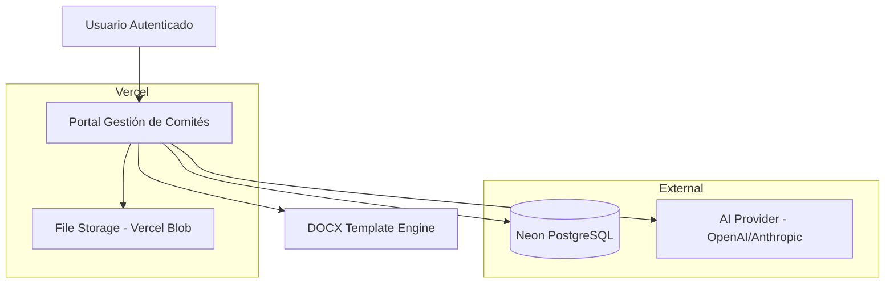

## Architecture

### High-Level Architecture

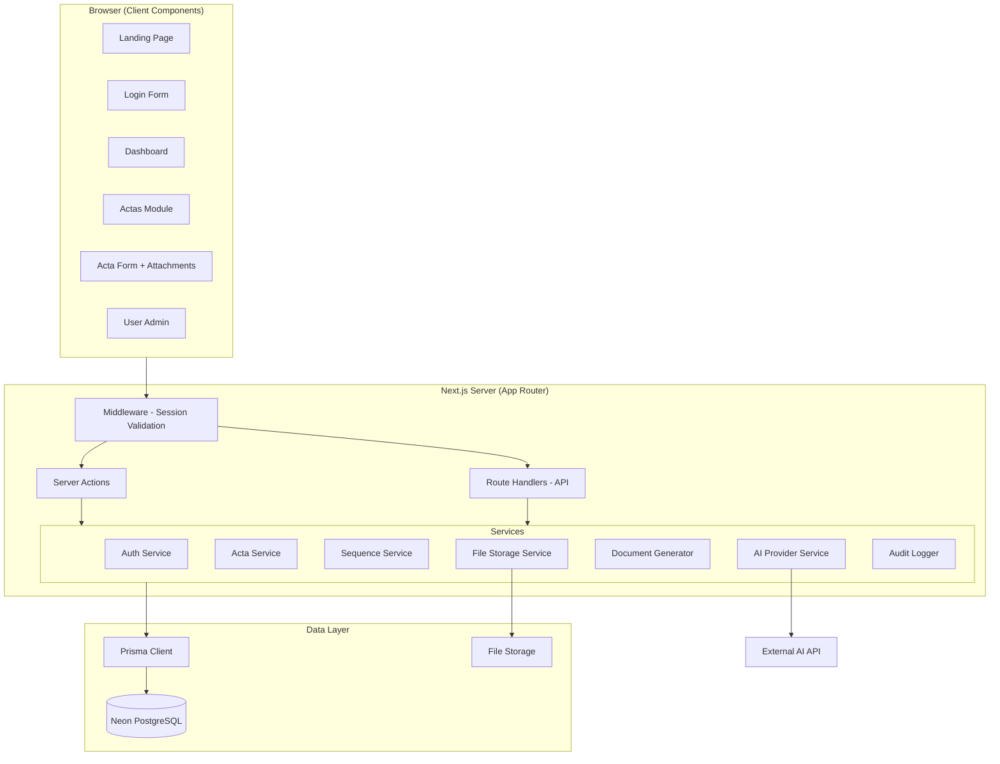

### Project Structure

```
gestor-comites/
├── src/
│   ├── app/
│   │   ├── (public)/
│   │   │   ├── page.tsx                    # Landing page
│   │   │   └── login/page.tsx              # Login page
│   │   ├── (protected)/
│   │   │   ├── layout.tsx                  # Auth guard layout
│   │   │   ├── dashboard/page.tsx          # Dashboard
│   │   │   ├── actas/
│   │   │   │   ├── page.tsx                # Actas list
│   │   │   │   └── [id]/page.tsx           # Acta detail
│   │   │   └── admin/
│   │   │       └── usuarios/page.tsx       # User admin
│   │   ├── api/
│   │   │   ├── files/[id]/route.ts         # File serving (authenticated)
│   │   │   └── health/route.ts             # Health check
│   │   ├── layout.tsx                      # Root layout
│   │   └── globals.css                     # Tailwind + UCC styles
│   ├── components/
│   │   ├── ui/                             # Reusable UI primitives
│   │   ├── forms/                          # Form components
│   │   ├── actas/                          # Acta-specific components
│   │   └── admin/                          # Admin-specific components
│   ├── lib/
│   │   ├── auth/
│   │   │   ├── session.ts                  # iron-session config
│   │   │   ├── actions.ts                  # Login/logout server actions
│   │   │   └── guards.ts                   # Role-based access helpers
│   │   ├── services/
│   │   │   ├── acta.service.ts             # Acta business logic
│   │   │   ├── sequence.service.ts         # Sequential numbering
│   │   │   ├── ai/
│   │   │   │   ├── provider.interface.ts   # AI provider contract
│   │   │   │   ├── openai.provider.ts      # OpenAI implementation
│   │   │   │   ├── anthropic.provider.ts   # Anthropic implementation
│   │   │   │   ├── fallback.provider.ts    # Deterministic fallback
│   │   │   │   └── factory.ts             # Provider factory
│   │   │   ├── document.service.ts         # DOCX generation
│   │   │   ├── file-storage.service.ts     # File upload/storage
│   │   │   ├── audit.service.ts            # Audit logging
│   │   │   └── user.service.ts             # User management
│   │   ├── db/
│   │   │   └── prisma.ts                   # Prisma client singleton
│   │   ├── validations/
│   │   │   ├── auth.schema.ts              # Auth validation schemas
│   │   │   ├── acta.schema.ts              # Acta validation schemas
│   │   │   ├── user.schema.ts              # User validation schemas
│   │   │   └── file.schema.ts              # File validation schemas
│   │   └── utils/
│   │       ├── date.ts                     # Timezone helpers (America/Bogota)
│   │       ├── sanitize.ts                 # Input sanitization
│   │       └── constants.ts                # App-wide constants
│   ├── actions/
│   │   ├── auth.actions.ts                 # Auth server actions
│   │   ├── acta.actions.ts                 # Acta CRUD server actions
│   │   ├── user.actions.ts                 # User management actions
│   │   └── file.actions.ts                 # File upload actions
│   └── types/
│       └── index.ts                        # Shared TypeScript types
├── prisma/
│   ├── schema.prisma                       # Database schema
│   ├── seed.ts                             # Seed data
│   └── migrations/                         # Migration files
├── templates/
│   └── acta-comite-curricular-ing-industrial.docx  # Institutional template
├── public/
│   └── images/                             # Static assets (logos, etc.)
├── .env.example                            # Environment variable template
├── .gitignore
├── next.config.ts
├── tailwind.config.ts
├── tsconfig.json
├── package.json
└── README.md
```

### Request Flow

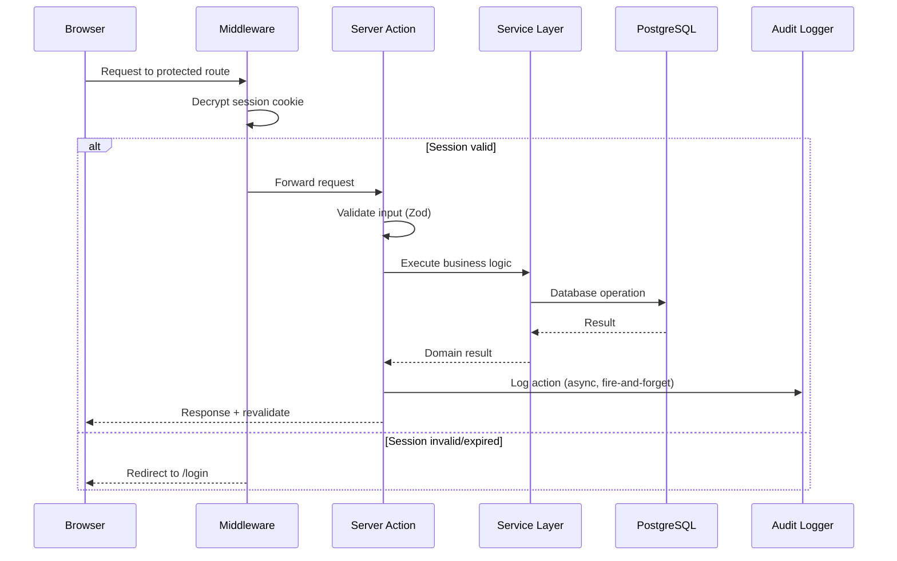

## Components and Interfaces

### Core Service Interfaces

```typescript
// AI Provider Interface (Strategy Pattern)
interface IAIProvider {
  generateActaContent(input: ActaGenerationInput): Promise<ActaGenerationResult>;
  extractTextFromDocument(buffer: Buffer, mimeType: string): Promise<string>;
  isAvailable(): Promise<boolean>;
}

interface ActaGenerationInput {
  ordenDia: string;
  asistentes: { nombre: string; cargo: string }[];
  attachmentTexts: string[];
  tipoComite: TipoComite;
  areaPrograma: string;
}

interface ActaGenerationResult {
  desarrollo: string;
  success: boolean;
  provider: string; // Which provider generated it
  error?: string;
}

// Sequence Service Interface
interface ISequenceService {
  getNextNumber(committeeCode: string, year: number): Promise<SequenceResult>;
}

interface SequenceResult {
  success: boolean;
  numero: string;       // e.g., "ACTA-CUR-2026-0001"
  secuencia: number;    // e.g., 1
  anio: number;         // e.g., 2026
  error?: string;
}

// Document Generator Interface
interface IDocumentGenerator {
  generateActaDocx(data: ActaDocxData): Promise<GeneratedDocument>;
}

interface ActaDocxData {
  numeroActa: string;
  ciudadFecha: string;
  hora: string;
  lugar: string;
  asistentes: { nombre: string; cargo: string }[];
  ordenDia: string;
  desarrollo: string;
  proyecto: string;
  reviso: string;
  copia?: string;
}

interface GeneratedDocument {
  buffer: Buffer;
  filename: string;
  size: number;
}

// File Storage Interface
interface IFileStorage {
  upload(file: File, metadata: FileMetadata): Promise<StorageResult>;
  delete(storagePath: string): Promise<void>;
  getStream(storagePath: string): Promise<ReadableStream>;
  getUrl(storagePath: string): string;
}

// Audit Logger Interface
interface IAuditLogger {
  log(entry: AuditEntry): void; // Fire-and-forget, non-blocking
}

interface AuditEntry {
  userId?: string;
  action: AuditAction;
  entityType: string;
  entityId?: string;
  metadataJson?: Record<string, unknown>;
  ipAddress: string;
}

type AuditAction = 
  | 'CREATE' | 'UPDATE' | 'DELETE' 
  | 'DOWNLOAD' | 'GENERATE' 
  | 'LOGIN_SUCCESS' | 'LOGIN_FAILED'
  | 'SESSION_CREATED' | 'SESSION_EXPIRED'
  | 'UPLOAD' | 'FILE_DELETE';
```

### React Component Architecture

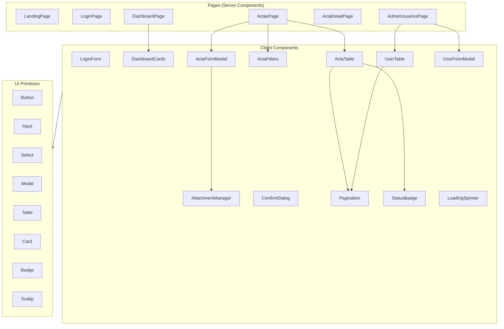

### Key Component Specifications

| Component | Type | Props | Responsibility |
|-----------|------|-------|----------------|
| `ActaFormModal` | Client | `isOpen, onClose, onSuccess` | Multi-step acta creation form |
| `AttachmentManager` | Client | `actaId?, files, onFilesChange` | File upload/management within form |
| `ActaTable` | Client | `actas, pagination, userRole` | Display/action table for actas |
| `ActaFilters` | Client | `onFilter, onClear` | Search/filter controls |
| `UserTable` | Client | `users, pagination, onEdit, onToggle` | User list with actions |
| `StatusBadge` | Client | `estado: EstadoActa` | Color-coded status display |
| `LoadingSpinner` | Client | `message?, blocking?` | Full-screen or inline loading |
| `ConfirmDialog` | Client | `title, message, onConfirm, onCancel` | Destructive action confirmation |

## Data Models

### Database Schema (Prisma)

```prisma
generator client {
  provider = "prisma-client-js"
}

datasource db {
  provider  = "postgresql"
  url       = env("DATABASE_URL")
}

enum Rol {
  Administrador
  Usuario_Gestor
  Consulta
}

enum EstadoActa {
  Borrador
  Generada
  Descargada
  Error_generacion
  En_procesamiento
}

enum EstadoCarga {
  pendiente
  subiendo
  completado
  error
}

enum EstadoProcesamiento {
  pendiente
  procesando
  completado
  error
  no_soportado
}

model User {
  id              String   @id @default(cuid())
  nombreCompleto  String   @map("nombre_completo") @db.VarChar(100)
  usuario         String   @unique @db.VarChar(50)
  passwordHash    String   @map("password_hash")
  cargo           String   @db.VarChar(100)
  correo          String   @db.VarChar(150)
  rol             Rol      @default(Consulta)
  activo          Boolean  @default(true)
  failedAttempts  Int      @default(0) @map("failed_attempts")
  lockedUntil     DateTime? @map("locked_until")
  createdAt       DateTime @default(now()) @map("created_at")
  updatedAt       DateTime @updatedAt @map("updated_at")

  actas           Acta[]   @relation("ElaboradoPor")
  auditLogs       AuditLog[]

  @@map("users")
}

model Committee {
  id        String   @id @default(cuid())
  nombre    String   @db.VarChar(100)
  codigo    String   @unique @db.VarChar(10)
  activo    Boolean  @default(true)
  createdAt DateTime @default(now()) @map("created_at")
  updatedAt DateTime @updatedAt @map("updated_at")

  @@map("committees")
}

model Acta {
  id                    String      @id @default(cuid())
  numeroActa            String      @unique @map("numero_acta")
  secuencia             Int
  anio                  Int
  fechaGeneracion       DateTime    @map("fecha_generacion")
  ciudad                String      @default("Bogotá D.C.") @db.VarChar(100)
  horaInicio            String?     @map("hora_inicio") @db.VarChar(10)
  horaFin               String?     @map("hora_fin") @db.VarChar(10)
  lugar                 String?     @db.VarChar(200)
  tipoComite            String      @map("tipo_comite") @db.VarChar(50)
  areaPrograma          String      @map("area_programa") @db.VarChar(100)
  ordenDia              String      @map("orden_dia") @db.Text
  asistentesJson        Json        @map("asistentes_json")
  desarrolloGenerado    String?     @map("desarrollo_generado") @db.Text
  presidenteNombre      String?     @map("presidente_nombre") @db.VarChar(150)
  presidenteCargo       String?     @map("presidente_cargo") @db.VarChar(100)
  elaboradoPorUsuarioId String      @map("elaborado_por_usuario_id")
  elaboradoPorNombre    String      @map("elaborado_por_nombre") @db.VarChar(150)
  elaboradoPorCargo     String      @map("elaborado_por_cargo") @db.VarChar(100)
  copia                 String?     @db.VarChar(300)
  proyecto              String      @db.VarChar(150)
  reviso                String      @db.VarChar(150)
  estado                EstadoActa  @default(Borrador)
  docxPath              String?     @map("docx_path")
  docxFilename          String?     @map("docx_filename")
  createdAt             DateTime    @default(now()) @map("created_at")
  updatedAt             DateTime    @updatedAt @map("updated_at")

  elaboradoPor          User        @relation("ElaboradoPor", fields: [elaboradoPorUsuarioId], references: [id])
  attachments           Attachment[]

  @@index([tipoComite, anio])
  @@index([estado])
  @@index([fechaGeneracion])
  @@map("actas")
}

model Attachment {
  id                  String              @id @default(cuid())
  actaId              String              @map("acta_id")
  nombreArchivo       String              @map("nombre_archivo") @db.VarChar(255)
  tipoMime            String              @map("tipo_mime") @db.VarChar(100)
  extension           String              @db.VarChar(20)
  sizeBytes           Int                 @map("size_bytes")
  storagePath         String              @map("storage_path")
  estadoCarga         EstadoCarga         @default(pendiente) @map("estado_carga")
  estadoProcesamiento EstadoProcesamiento @default(pendiente) @map("estado_procesamiento")
  textoExtraido       String?             @map("texto_extraido") @db.Text
  errorProcesamiento  String?             @map("error_procesamiento") @db.Text
  createdAt           DateTime            @default(now()) @map("created_at")
  updatedAt           DateTime            @updatedAt @map("updated_at")

  acta                Acta                @relation(fields: [actaId], references: [id], onDelete: Cascade)

  @@index([actaId])
  @@map("attachments")
}

model AuditLog {
  id           String   @id @default(cuid())
  userId       String?  @map("user_id")
  action       String   @db.VarChar(50)
  entityType   String   @map("entity_type") @db.VarChar(50)
  entityId     String?  @map("entity_id")
  metadataJson Json?    @map("metadata_json")
  ipAddress    String?  @map("ip_address") @db.VarChar(45)
  createdAt    DateTime @default(now()) @map("created_at")

  user         User?    @relation(fields: [userId], references: [id])

  @@index([userId])
  @@index([action])
  @@index([createdAt])
  @@map("audit_logs")
}

model Sequence {
  id            String   @id @default(cuid())
  committeeCode String   @map("committee_code") @db.VarChar(10)
  year          Int
  lastNumber    Int      @default(0) @map("last_number")
  createdAt     DateTime @default(now()) @map("created_at")
  updatedAt     DateTime @updatedAt @map("updated_at")

  @@unique([committeeCode, year])
  @@map("sequences")
}
```

### Entity Relationship Diagram

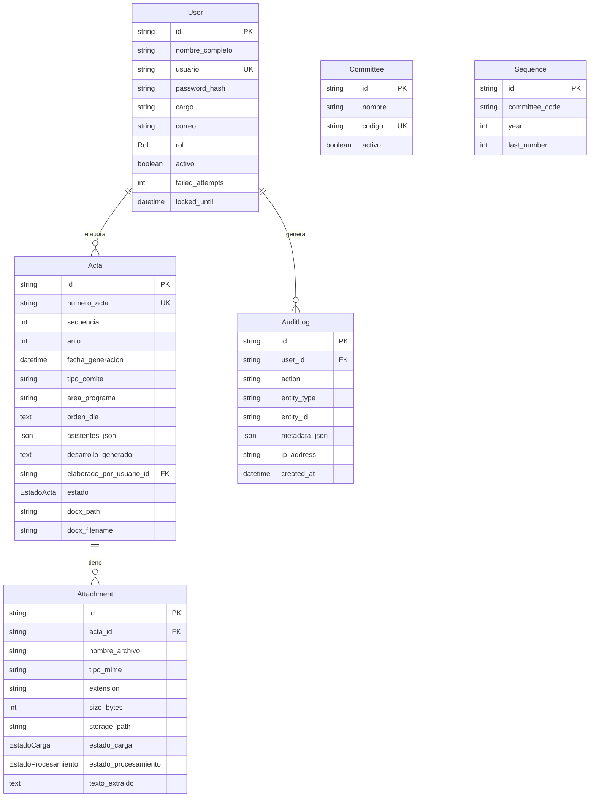

### Session Data Structure

```typescript
// iron-session session data (stored in encrypted cookie)
interface SessionData {
  userId: string;
  nombreCompleto: string;
  usuario: string;
  cargo: string;
  rol: Rol;
  correo: string;
  loginAt: string;        // ISO timestamp (America/Bogota)
  lastActivity: string;   // ISO timestamp for inactivity tracking
}

// Session configuration
const sessionOptions: SessionOptions = {
  password: process.env.SESSION_SECRET!, // min 32 chars
  cookieName: 'gestor_comites_session',
  cookieOptions: {
    secure: process.env.NODE_ENV === 'production',
    httpOnly: true,
    sameSite: 'lax' as const,
    maxAge: 8 * 60 * 60, // 8 hours absolute max
  },
};
```


## Correctness Properties

*A property is a characteristic or behavior that should hold true across all valid executions of a system—essentially, a formal statement about what the system should do. Properties serve as the bridge between human-readable specifications and machine-verifiable correctness guarantees.*

### Property 1: Session creation contains all required fields

*For any* valid user with matching credentials (correct usuario, contraseña, and cargo), the created session must contain all required fields: userId, nombreCompleto, usuario, cargo, rol, correo, and loginAt timestamp in America/Bogota timezone.

**Validates: Requirements 2.2**

### Property 2: Invalid credentials produce only generic error messages

*For any* login attempt with invalid credentials (wrong usuario, wrong password, or wrong cargo), the returned error message must be identical regardless of which field was incorrect, and must not reveal internal system details, stack traces, file paths, or database information.

**Validates: Requirements 2.3, 13.5**

### Property 3: Session expiry based on time thresholds

*For any* session with lastActivity timestamp more than 30 minutes in the past OR loginAt timestamp more than 8 hours in the past, session validation must return invalid and the user must be redirected to login.

**Validates: Requirements 2.6, 13.9**

### Property 4: Protected routes require valid session

*For any* request to any protected route (under /dashboard, /actas, /admin), without a valid non-expired session cookie, the system must deny access and return HTTP 401.

**Validates: Requirements 2.5, 2.7**

### Property 5: Account lock after consecutive failed attempts

*For any* user account with 5 or more consecutive failed login attempts where the lock period (15 minutes) has not expired, the system must reject login attempts for that account regardless of credential correctness.

**Validates: Requirements 2.8**

### Property 6: Successful authentication resets failure counter

*For any* user who successfully authenticates, the failedAttempts counter must be 0 after the operation completes.

**Validates: Requirements 2.9**

### Property 7: User input validation consistency

*For any* user creation or edit input, the system must accept the input if and only if: nombre_completo is 1-100 characters, usuario is 3-50 characters and unique (for creation), password has minimum 8 characters with at least one uppercase, one lowercase, and one number (for creation), cargo is 1-100 characters, correo is valid email format and max 150 characters, and rol is one of the three valid values.

**Validates: Requirements 3.2, 3.4**

### Property 8: Duplicate username rejection

*For any* username string that already exists in the users table, attempting to create a new user with that same username must fail with an appropriate error.

**Validates: Requirements 3.3**

### Property 9: Last administrator protection invariant

*For any* set of active users where only one has the Administrador role, deactivating or changing the role of that user must be rejected. Additionally, any admin attempting to deactivate their own account must be rejected.

**Validates: Requirements 3.6**

### Property 10: Deactivated users cannot authenticate

*For any* user where activo = false, login attempts must be rejected with an account-inactive message, even when the provided credentials are correct.

**Validates: Requirements 3.8**

### Property 11: Role-based UI element visibility

*For any* authenticated user, the visibility of UI elements must be determined solely by their role: admin button visible iff rol = Administrador; "+ Nueva Acta" button visible iff rol != Consulta; action buttons restricted to read-only set when rol = Consulta.

**Validates: Requirements 3.9, 4.5, 4.6, 5.8**

### Property 12: Acta list pagination and sort order

*For any* set of actas matching current filters, the displayed page must contain at most 10 rows, sorted by fecha_generacion in descending order (most recent first).

**Validates: Requirements 5.3**

### Property 13: Status badge color mapping

*For any* valid EstadoActa value, the rendered badge color must match exactly: Borrador→gray, Generada→green, Descargada→blue, Error_generacion→red, En_procesamiento→orange.

**Validates: Requirements 5.4**

### Property 14: Form field validation enforcement

*For any* acta form submission where at least one required field is empty or exceeds its maximum length (orden_dia > 1200 chars, asistentes < 1 or > 50 rows, any attendee row with empty nombre/cargo), the submission must be prevented and validation errors shown per invalid field.

**Validates: Requirements 6.4, 6.5, 6.9**

### Property 15: File extension allowlist enforcement

*For any* file with an extension not in the allowed set (.docx, .doc, .pdf, .xlsx, .xls, .png, .jpg, .jpeg, .gif, .mp3, .mp4, .wav, .avi, .txt, .csv, .pptx), upload must be rejected. For any file with an allowed extension, upload must be accepted (assuming other constraints pass).

**Validates: Requirements 7.2**

### Property 16: File size limit enforcement

*For any* file exceeding MAX_FILE_SIZE_MB in size, upload must be rejected with an error identifying the file name and size limit, while all other previously uploaded files remain unchanged.

**Validates: Requirements 7.3**

### Property 17: Content-type and extension mismatch detection

*For any* file where the detected MIME type does not match the declared file extension, the system must reject the file with a content-type mismatch error.

**Validates: Requirements 7.8**

### Property 18: File name sanitization

*For any* input filename string, the sanitized output must contain only alphanumeric characters, hyphens, underscores, and dots. All path traversal sequences (../, ..\) and other special characters must be removed.

**Validates: Requirements 7.9**

### Property 19: AI fallback on provider failure

*For any* acta generation request where the configured AI provider is unavailable or returns an error, the system must fall back to structured generation using only form data, and the resulting output must be valid structured content derived exclusively from the Acta_Form data.

**Validates: Requirements 8.6**

### Property 20: Media files accepted but content not extracted

*For any* uploaded file with a media MIME type (image/png, image/jpg, image/jpeg, image/gif, audio/mp3, video/mp4, audio/wav, video/avi), the file must be accepted and stored, but estadoProcesamiento must be set to 'no_soportado' and textoExtraido must remain null.

**Validates: Requirements 8.10**

### Property 21: Template placeholder replacement completeness

*For any* valid ActaDocxData, after document generation no raw placeholder text ({{PLACEHOLDER_NAME}}) must remain in the output. All defined placeholders must be replaced with their corresponding values or empty strings if values are unavailable.

**Validates: Requirements 9.2**

### Property 22: Output filename format compliance

*For any* valid combination of committee prefix (CUR|INV|DEC|OTR), year (4 digits), sequence (1-9999), committee type name, and program name, the generated filename must match pattern: ACTA-{PREFIX}-{YEAR}-{0-padded 4-digit SEQ}-Comite-{TYPE}-{PROGRAM}.docx

**Validates: Requirements 9.4**

### Property 23: Sequence number format and independence

*For any* committee code and year, the generated sequence number must follow format ACTA-{CODE}-{YEAR}-{0-padded 4-digit SEQ}. Incrementing a sequence for one (code, year) combination must not affect the counter of any other (code, year) combination.

**Validates: Requirements 10.1, 10.2**

### Property 24: New year sequence initialization

*For any* committee code encountering its first request in a new calendar year (America/Bogota timezone), the sequence must start at 0001.

**Validates: Requirements 10.3**

### Property 25: Sequence uniqueness under concurrency

*For any* n concurrent sequence generation requests for the same (committeeCode, year), all n returned sequence numbers must be distinct.

**Validates: Requirements 10.4**

### Property 26: Audit entry creation for all auditable actions

*For any* action of type create, update, delete, download, generation, login_failed, or session event, an audit_log entry must be created containing all required fields (userId for authenticated actions, action type, entity type, timestamp in America/Bogota timezone, IP address, and relevant metadata).

**Validates: Requirements 11.1, 11.2, 11.3**

### Property 27: Seed idempotency

*For any* number of seed executions n ≥ 1, the count of committee records, program records, and admin user records in the database must remain constant (no duplicates created).

**Validates: Requirements 12.6**

### Property 28: Input sanitization removes dangerous content

*For any* input string containing HTML tags, script content, SQL metacharacters outside ORM context, or path traversal sequences, the sanitized output must not contain those patterns.

**Validates: Requirements 13.4**

### Property 29: AI factory fallback selection

*For any* application startup configuration where AI_PROVIDER environment variable is unset or empty, the AI provider factory must return the deterministic fallback provider and the system must operate normally.

**Validates: Requirements 14.5**

### Property 30: Missing required environment variable detection

*For any* single missing required environment variable from the set {DATABASE_URL, SESSION_SECRET, ADMIN_USER, ADMIN_PASSWORD, ADMIN_EMAIL}, application startup must fail and the error message must contain the name of the missing variable.

**Validates: Requirements 14.7**

## Error Handling

### Error Handling Strategy

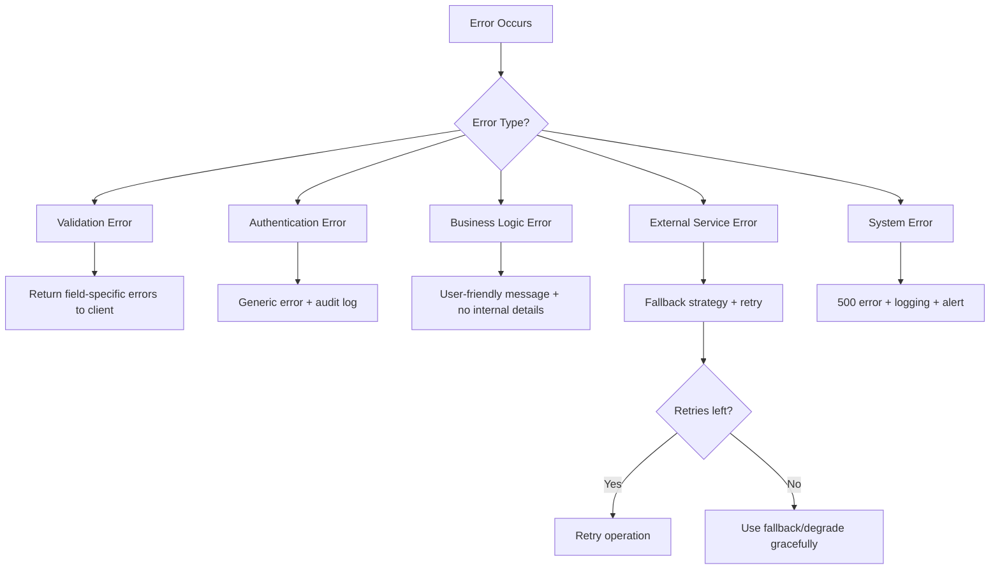

### Error Categories and Handling

| Category | Example | User Response | Internal Action |
|----------|---------|---------------|-----------------|
| Validation | Empty required field | Field-specific error messages | None |
| Authentication | Wrong password | "Credenciales inválidas" (generic) | Increment failed counter + audit |
| Authorization | Non-admin accessing admin | HTTP 403 + redirect to dashboard | Audit log |
| Concurrency | Sequence lock contention | Transparent retry (up to 3x) | Log retry attempts |
| AI Provider | API timeout/error | Automatic fallback to structured gen | Audit log + retry |
| Document Gen | Corrupted template | "Error en generación" + keep state | Error log with details |
| File Upload | Size exceeded | File-specific error message | None |
| Database | Connection failure | "Error del servidor" | Retry 3x + fallback log store for audit |
| Rate Limit | 5+ failed logins | "Cuenta temporalmente bloqueada" | Audit log |

### Structured Error Response

```typescript
// Standard error response type
interface ActionResult<T = void> {
  success: boolean;
  data?: T;
  error?: {
    code: ErrorCode;
    message: string;            // User-facing (Spanish)
    fieldErrors?: Record<string, string>;  // Per-field validation errors
  };
}

type ErrorCode = 
  | 'VALIDATION_ERROR'
  | 'INVALID_CREDENTIALS'
  | 'ACCOUNT_LOCKED'
  | 'ACCOUNT_INACTIVE'
  | 'UNAUTHORIZED'
  | 'FORBIDDEN'
  | 'NOT_FOUND'
  | 'CONFLICT'             // e.g., duplicate username
  | 'SEQUENCE_EXHAUSTED'
  | 'FILE_TOO_LARGE'
  | 'INVALID_FILE_TYPE'
  | 'MIME_MISMATCH'
  | 'GENERATION_FAILED'
  | 'INTERNAL_ERROR';
```

### Retry and Fallback Policies

| Operation | Max Retries | Backoff | Fallback |
|-----------|-------------|---------|----------|
| Sequence generation | 3 | 50ms exponential | Error response |
| AI generation | 1 (timeout 5min) | N/A | Structured fallback |
| Audit log write | 3 | 100ms linear | Write to fallback store (file/memory) |
| DB connection | 3 | 100ms exponential | 500 error |
| File upload | 0 | N/A | Error per file |

## Testing Strategy

### Testing Pyramid

```
         ╱╲
        ╱ E2E ╲         (Cypress/Playwright - critical flows)
       ╱────────╲
      ╱Integration╲     (API routes, DB operations, file ops)
     ╱──────────────╲
    ╱  Property Tests  ╲  (fast-check - 100+ iterations per property)
   ╱────────────────────╲
  ╱      Unit Tests       ╲ (Vitest - validators, utils, services)
 ╱──────────────────────────╲
```

### Property-Based Testing (PBT)

**Library:** [fast-check](https://github.com/dubzzz/fast-check) for TypeScript/JavaScript
**Configuration:** Minimum 100 iterations per property test
**Runner:** Vitest with fast-check integration

Each property test references its design document property:

```typescript
// Example: Property 18 - File name sanitization
// Feature: portal-gestion-comites, Property 18: File name sanitization
test.prop('sanitized filenames contain only safe characters', [fc.string()], (input) => {
  const result = sanitizeFilename(input);
  expect(result).toMatch(/^[a-zA-Z0-9._-]*$/);
  expect(result).not.toContain('../');
  expect(result).not.toContain('..\\');
});
```

### Test Categories

| Category | Framework | Count Target | Focus |
|----------|-----------|--------------|-------|
| Unit Tests | Vitest | ~60 tests | Validators, utils, pure service logic |
| Property Tests | fast-check + Vitest | 30 properties × 100 iterations | Correctness properties from design |
| Integration Tests | Vitest + Prisma test utils | ~30 tests | DB operations, API routes, file I/O |
| E2E Tests | Playwright | ~15 flows | Critical user journeys |

### Unit Tests (Example-based)

Focus areas:
- Date/timezone formatting utilities
- Zod validation schema correctness (specific examples)
- Password strength validation edge cases
- Role permission matrix
- Status badge mapping
- Component rendering (React Testing Library)

### Integration Tests

Focus areas:
- Prisma operations with test database
- File upload/download through API routes
- Session creation and validation flow
- Sequence generation with real DB transactions
- Document generation with template

### E2E Tests (Critical Paths)

1. Landing → Login → Dashboard → Actas module
2. Create new acta (full form fill + submission)
3. File upload with validation errors
4. Admin user management (create, edit, deactivate)
5. Download generated document
6. Session expiry redirect
7. Failed login lockout flow

---

## Additional Design Sections

### Security Architecture

```mermaid
graph TD
    subgraph PublicRoutes["Public (No Auth)"]
        Landing[/ Landing Page]
        Login[/login]
    end

    subgraph ProtectedRoutes["Protected (Session Required)"]
        Dashboard[/dashboard]
        Actas[/actas]
        Admin[/admin/usuarios - Admin only]
    end

    subgraph SecurityLayers["Security Layers"]
        MW[Middleware: Session Decrypt + Validate]
        RBAC[Role-Based Access Control]
        InputVal[Input Validation - Zod]
        Sanitize[Input Sanitization]
        RateLimit[Rate Limiting - IP + User]
        FileVal[File Validation - Type + Size + MIME]
    end

    Request --> MW
    MW --> |Valid Session| RBAC
    MW --> |No Session| Login
    RBAC --> |Authorized| InputVal
    RBAC --> |Forbidden| 403
    InputVal --> Sanitize
    Sanitize --> Handler[Route Handler]
```

**Key Security Measures:**

1. **Session Security**: iron-session with AES-256 encryption, HttpOnly + Secure + SameSite cookies
2. **Password Storage**: bcrypt with 12 salt rounds
3. **Rate Limiting**: Per-IP and per-user counters stored in DB
4. **Input Sanitization**: Strip HTML/script tags, escape SQL metacharacters, remove path traversal
5. **File Security**: Extension allowlist, MIME type verification, storage outside public directory, authenticated serving
6. **Environment Isolation**: All secrets in env vars, .gitignore for sensitive files, .env.example with placeholders

### AI Integration Design

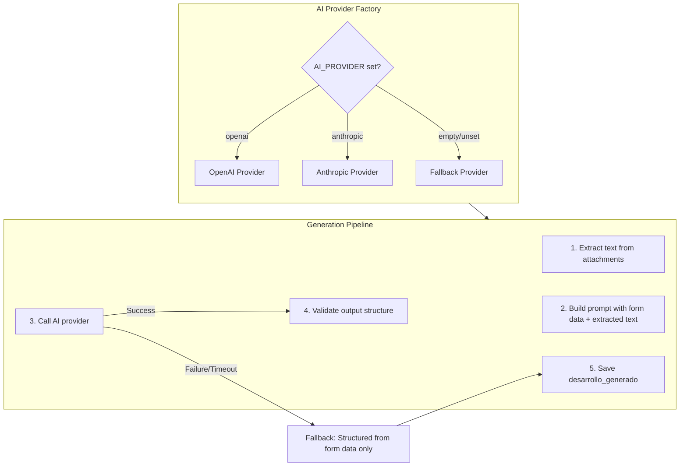

**Provider Interface Implementation:**

```typescript
// Factory selects provider based on env
function createAIProvider(): IAIProvider {
  const provider = process.env.AI_PROVIDER?.toLowerCase();
  
  switch (provider) {
    case 'openai':
      return new OpenAIProvider({
        apiKey: process.env.AI_API_KEY!,
        model: process.env.AI_MODEL || 'gpt-4o-mini',
      });
    case 'anthropic':
      return new AnthropicProvider({
        apiKey: process.env.AI_API_KEY!,
        model: process.env.AI_MODEL || 'claude-3-haiku-20240307',
      });
    default:
      return new FallbackProvider();
  }
}
```

**Fallback Provider** generates structured content using only form data:
- Lists all agenda points as sections
- Includes attendee information formatted as a table
- Uses neutral template language: "Se revisó el punto [X] del orden del día."
- No external API calls required

**Text Extraction:**
- PDF: `pdf-parse` library
- DOCX: `mammoth` library (text extraction)
- XLSX: `xlsx` library (cell content extraction)
- TXT/CSV: Direct buffer-to-string
- Images/Audio/Video: Stored only, flagged as `no_soportado`

### Document Generation Flow

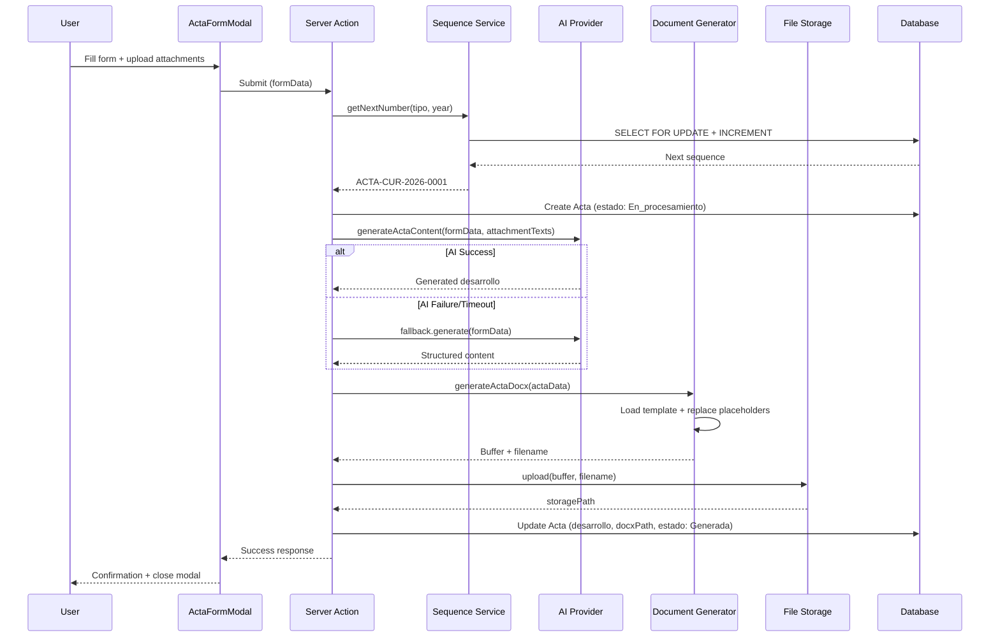

### File Upload/Storage Architecture

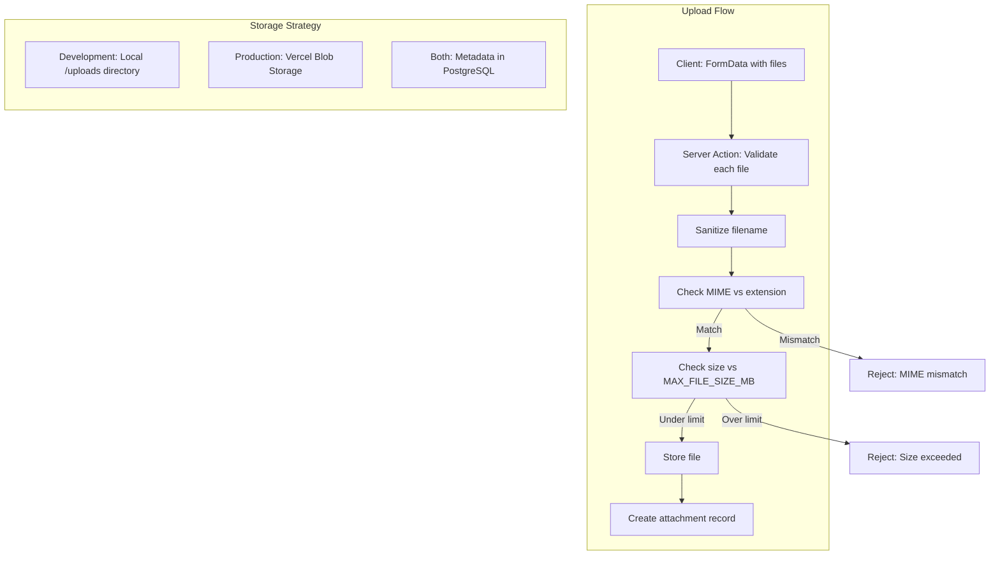

**Vercel Deployment Considerations:**
- Serverless functions have 4.5MB body limit → use client-side chunked upload for large files
- `/tmp` is ephemeral (512MB, destroyed between invocations) → use only for temp processing
- **Vercel Blob** for persistent file storage (configurable via STORAGE_PROVIDER env var)
- File serving via authenticated API route (`/api/files/[id]`) that streams from blob storage

**Storage Interface Abstraction:**
```typescript
// Allows switching between local (dev) and blob (prod) storage
interface IFileStorage {
  upload(file: Buffer, path: string, metadata: FileMetadata): Promise<StorageResult>;
  delete(path: string): Promise<void>;
  getStream(path: string): Promise<ReadableStream>;
}

// Local implementation for development
class LocalFileStorage implements IFileStorage { /* fs operations */ }

// Vercel Blob for production
class VercelBlobStorage implements IFileStorage { /* @vercel/blob SDK */ }
```

### Sequential Numbering Design

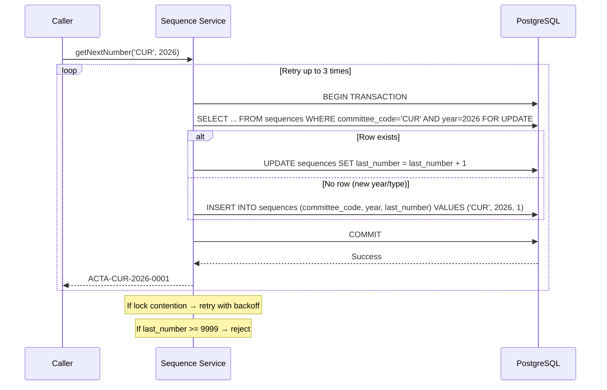

**Concurrency Safety:**
- `SELECT ... FOR UPDATE` acquires row-level lock
- Unique constraint on `(committee_code, year)` as secondary safeguard
- Exponential backoff (50ms, 100ms, 200ms) between retries
- Maximum 3 retry attempts before returning error

```typescript
async function getNextNumber(committeeCode: string, year: number): Promise<SequenceResult> {
  const MAX_RETRIES = 3;
  
  for (let attempt = 0; attempt < MAX_RETRIES; attempt++) {
    try {
      return await prisma.$transaction(async (tx) => {
        // Acquire row lock
        const seq = await tx.$queryRaw`
          SELECT * FROM sequences 
          WHERE committee_code = ${committeeCode} AND year = ${year}
          FOR UPDATE
        `;
        
        let nextNumber: number;
        
        if (seq.length === 0) {
          nextNumber = 1;
          await tx.sequence.create({
            data: { committeeCode, year, lastNumber: 1 }
          });
        } else {
          if (seq[0].last_number >= 9999) {
            throw new SequenceExhaustedError(committeeCode, year);
          }
          nextNumber = seq[0].last_number + 1;
          await tx.sequence.update({
            where: { committeeCode_year: { committeeCode, year } },
            data: { lastNumber: nextNumber }
          });
        }
        
        const formatted = `ACTA-${committeeCode}-${year}-${String(nextNumber).padStart(4, '0')}`;
        return { success: true, numero: formatted, secuencia: nextNumber, anio: year };
      });
    } catch (error) {
      if (attempt < MAX_RETRIES - 1 && isRetryable(error)) {
        await delay(50 * Math.pow(2, attempt));
        continue;
      }
      throw error;
    }
  }
}
```

### Audit Logging Design

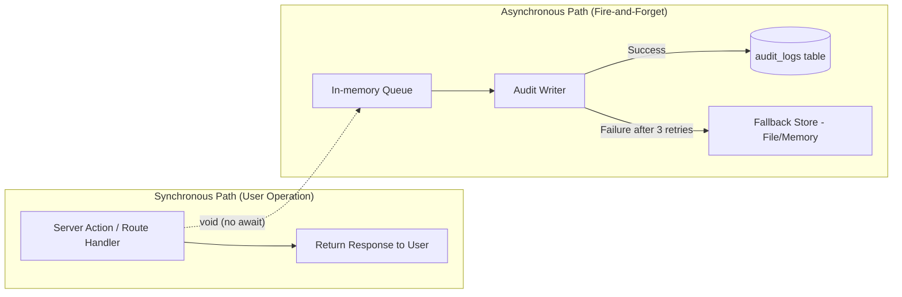

**Non-blocking Implementation:**

```typescript
class AuditLogger implements IAuditLogger {
  private queue: AuditEntry[] = [];
  private processing = false;

  log(entry: AuditEntry): void {
    // Fire-and-forget: does not block caller
    this.queue.push(entry);
    if (!this.processing) {
      this.processQueue();
    }
  }

  private async processQueue(): Promise<void> {
    this.processing = true;
    while (this.queue.length > 0) {
      const entry = this.queue.shift()!;
      await this.writeWithRetry(entry);
    }
    this.processing = false;
  }

  private async writeWithRetry(entry: AuditEntry, retries = 3): Promise<void> {
    for (let i = 0; i < retries; i++) {
      try {
        await prisma.auditLog.create({ data: entry });
        return;
      } catch (error) {
        if (i === retries - 1) {
          this.writeFallback(entry);
        }
        await delay(100 * (i + 1));
      }
    }
  }

  private writeFallback(entry: AuditEntry): void {
    // Write to console/file as last resort
    console.error('[AUDIT_FALLBACK]', JSON.stringify(entry));
  }
}
```

**Write-Only Enforcement:**
- No Prisma `update` or `delete` methods exposed for AuditLog model
- Database-level: `REVOKE UPDATE, DELETE ON audit_logs FROM app_user` (applied via migration)
- Application-level: AuditLogger only exposes `log()` method

### Deployment Architecture

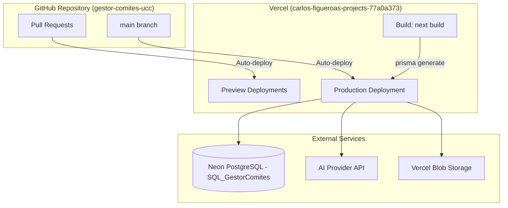

**Environment Variables (per deployment):**

| Variable | Required | Description |
|----------|----------|-------------|
| `DATABASE_URL` | Yes | Neon PostgreSQL connection string (pooled) |
| `SESSION_SECRET` | Yes | Minimum 32-character string for cookie encryption |
| `ADMIN_USER` | Yes | Initial admin username (seed only) |
| `ADMIN_PASSWORD` | Yes | Initial admin password (seed only) |
| `ADMIN_EMAIL` | Yes | Initial admin email (seed only) |
| `AI_PROVIDER` | No | `openai`, `anthropic`, or empty for fallback |
| `AI_API_KEY` | Conditional | Required if AI_PROVIDER is set |
| `AI_MODEL` | No | Model identifier (defaults per provider) |
| `MAX_FILE_SIZE_MB` | No | Default: 10 |
| `BLOB_READ_WRITE_TOKEN` | No | Vercel Blob storage token |
| `STORAGE_PROVIDER` | No | `local` or `vercel-blob` (default: local in dev) |

**Build & Deploy Pipeline:**

1. Push to `main` → Vercel auto-builds
2. `next build` compiles app (must pass with 0 errors)
3. `prisma generate` runs as part of build
4. Environment variables injected by Vercel
5. Preview deployments on PRs for testing
6. Migrations run separately via `npx prisma migrate deploy`

### Implementation Phases

The implementation follows 12 phases as specified in requirements:

| Phase | Scope | Key Deliverables |
|-------|-------|------------------|
| 1 | Project Setup | Next.js project, Prisma schema, env config, .gitignore |
| 2 | Database | Neon connection, migrations, seed data |
| 3 | Authentication | iron-session, login/logout, middleware, rate limiting |
| 4 | Landing + Dashboard | Public pages, dashboard cards, role-based UI |
| 5 | User Administration | CRUD users, role management, admin guard |
| 6 | Actas Module (Read) | List, filters, pagination, status badges |
| 7 | Acta Form + Validation | Modal form, attendee table, field validation |
| 8 | File Upload | Attachment manager, validation, storage |
| 9 | Sequential Numbering | Sequence service with concurrency safety |
| 10 | AI Integration | Provider interface, text extraction, fallback |
| 11 | Document Generation | docxtemplater, template replacement, download |
| 12 | Audit + Deploy | Audit logging, final testing, Vercel deployment |
